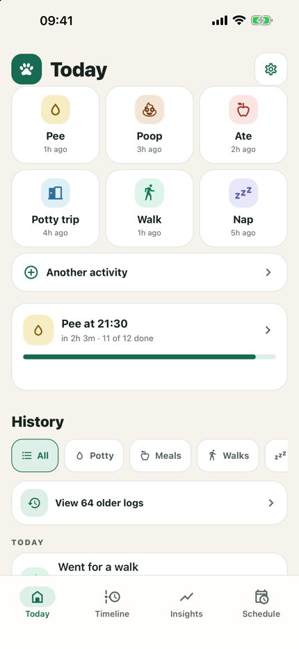
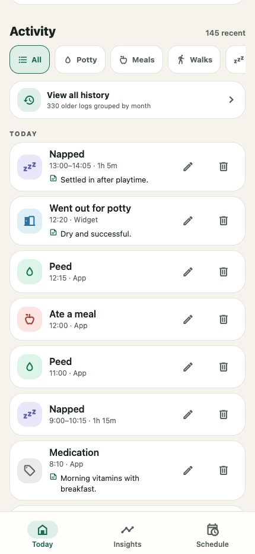
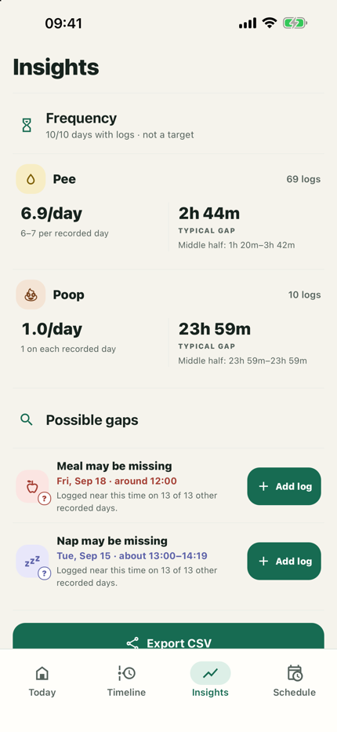
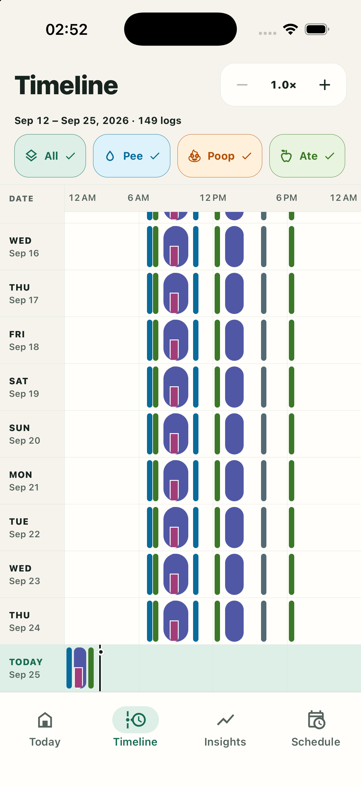
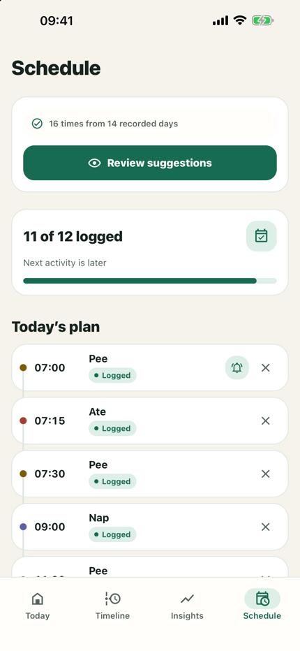
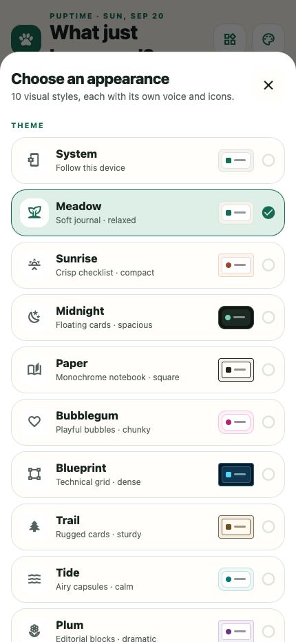

# Puptime

Puptime is a puppy activity log for Android and iOS. Data stays on the device.

## Screenshots

<table>
  <tr>
    <th>Today</th>
    <th>Activity history</th>
    <th>Insights</th>
  </tr>
  <tr>
    <td></td>
    <td></td>
    <td></td>
  </tr>
  <tr>
    <th>Timing patterns</th>
    <th>Daily routine</th>
    <th>Settings</th>
  </tr>
  <tr>
    <td></td>
    <td></td>
    <td></td>
  </tr>
</table>

## Features

- Log pee, poop, meals, potty trips, walks, naps, and custom activities, with haptic confirmation and undo. Named activities stay available as quick actions, routine choices, timeline filters, frequency summaries, and widget actions.
- Start and stop naps, then edit their start and end times.
- Add typed or dictated notes and edit an activity, name, date, time, or note.
- Filter recent history or open the month-by-month archive.
- Set a daily routine, choose when reminders arrive, and review suggested times before using them.
- Get customizable potty nudges after the latest pee or meal log.
- Compare activity timing across 10, 20, or 30 days and view pee and poop frequency summaries.
- Review possible missing logs, including estimated nap spans, before adding anything.
- Export the complete activity history, notes, and timestamps as CSV.
- Choose two to four Home Screen widget actions and optional confirmation notifications.
- Manage themes, language, widget actions, and notifications in Settings.
- Keep data on the device without an account, subscription, server, ads, analytics, or tracking.

The starter routine is only an editable example, not veterinary guidance. Change it to fit your puppy and your veterinarian’s advice.

## Install on Android

Download the APK from the [latest GitHub release](https://github.com/patrickchin/puptime/releases/latest), open it on your phone, and allow installation from that source if Android asks.

Open Settings from the gear on the Today screen to choose the two to four actions shown on your home screen. Pee, poop, and meals are the default; an active nap temporarily appears so it can always be ended.

The Android widget uses the available height for its action buttons. Long-press it to resize it. In the app, tap the pencil beside a log to change its activity, custom name, date, time, or note. Edits save automatically, even if you close the editor. Nap logs have separate start and end times.

Puptime does not end an open nap or add estimated sleep. If you forgot to stop a nap, tap **End nap**, then edit its end time. A possible-gap suggestion may include a nap span based on past durations. Nothing is added until you tap **Add log**. Nap taps saved by Puptime 1.1 remain point events.

Saved notes and activity data stay on your device. Voice dictation uses your phone's Apple or Android speech-recognition service, which may require a network connection depending on the device and downloaded language models.

From **Insights**, use **Export activity CSV** to open the system share sheet. Puptime creates the file in temporary app storage. The data is not sent until you choose a destination.

Routine reminders are optional. Turn one on while editing a planned time, then choose how early reminders should arrive in Settings. Puptime can also remind you after the latest pee or meal; the default potty nudges are two hours after a pee and 30 minutes after a meal, and each can be turned off or changed from 15 minutes to four hours. Puptime schedules reminders locally; it does not upload the routine or require a notification server. Settings can also enable a local confirmation after every widget log so you can immediately add a note or open the full editor.

Routine suggestions also stay on the device. Puptime checks the last 14 days, keeps activities logged on most recorded days, and rounds their typical times to 15 minutes. You review the full suggestion before replacing the current routine. Suggested reminders start off.

See [How Puptime learns patterns](LEARNING.md) for the exact routine-learning, event-matching, missing-log, and nap-estimation algorithms and their limits.

## Run locally

Requires Node.js 22.13 or newer, the Android SDK for Android, and Xcode for iOS.

```sh
npm ci
npm run prebuild
npm run android
```

The widgets use native extensions, so they require a development or release build rather than Expo Go. Interactive iOS widget buttons require iOS 17 or newer.

## Checks and release build

```sh
npm run typecheck
npm test
npx expo export --platform android
npx expo export --platform ios
npm run build:android
```

## iOS end-to-end tests

The Maestro suite covers navigation, activity CRUD and persistence, naps, custom activities, routine editing and reminder permission handling, widget and appearance settings, localization, Insights, and Timeline controls.

Install [Maestro](https://docs.maestro.dev/maestro-cli/how-to-install-maestro-cli), boot an iOS 26 Simulator, and install a local Puptime build with `npm run ios`. Keep Expo running, then run this in another terminal:

```sh
npm run test:e2e:ios
```

Every flow clears app state before it starts. GitHub Actions also runs the complete suite against the standalone Release build and uploads the Maestro report and failure artifacts.

The release APK is written to `android/app/build/outputs/apk/release/app-release.apk`.

GitHub Actions also performs an unsigned native iOS Simulator build of the app and widget, installs and launches it, then keeps the zipped `.app` and smoke-test screenshot as short-lived workflow artifacts.

## Stack

- Expo SDK 57 / React Native 0.86 / React 19
- TypeScript
- AsyncStorage for offline persistence
- `react-native-android-widget` on Android
- Expo Widgets and SwiftUI on iOS

## License

MIT

## Privacy

See the [Puptime privacy policy](PRIVACY.md).
